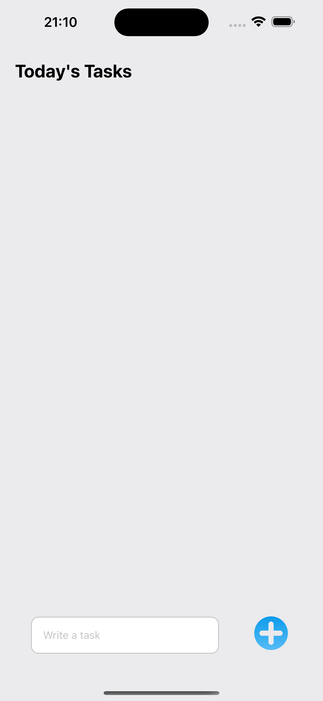
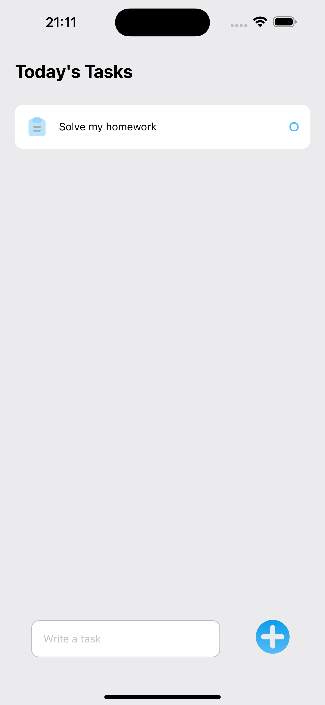
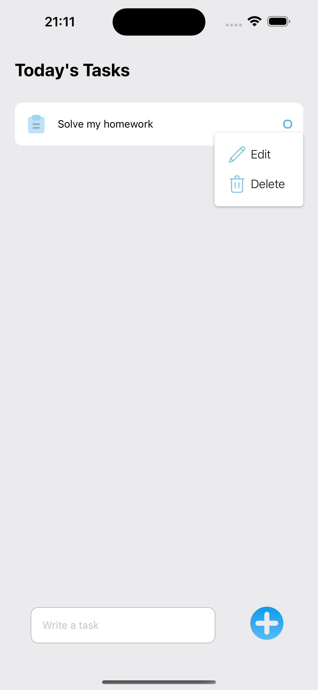
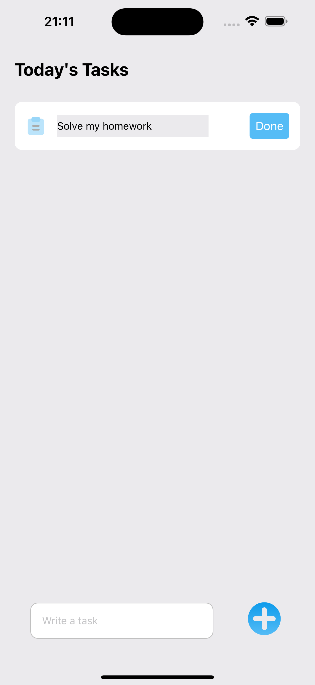

# Todo List App - React Native

This is a simple todo list app built with React Native.

## Features

- Add tasks to your todo list
- Mark tasks as complete
- Edit existing tasks
- Delete tasks
- User-friendly interface

## Getting Started

These instructions will help you set up and run the project on your local machine.

### Prerequisites

Make sure you have the following software installed on your machine:

- [Node.js](https://nodejs.org/)
- [npm](https://www.npmjs.com/) or [Yarn](https://yarnpkg.com/)
- [Expo CLI](https://docs.expo.dev/get-started/installation/)


### Screenshots
<div style="display:flex; justify-content: space-around; width:100%">
  
  
  
  
</div>

### Installing

1. Clone the repository:

   ```bash
   git clone https://github.com/IbraheemShawhnee/Todo-List-React-Native.git

2. Navigate to the project directory:
   
   ```bash
   cd todo-list-react-native

4. Install dependencies:
   
   ```bash
   npm install
   
5. Start the Expo development server:
   
  ```bash
  npx expo star


